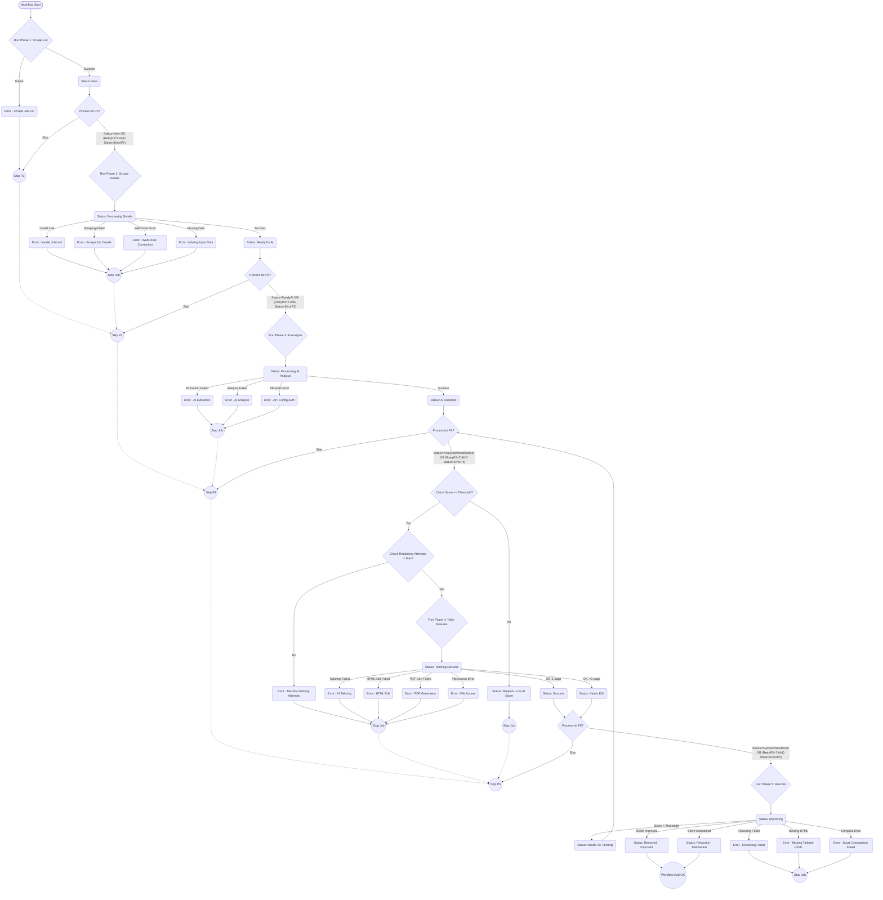

# LinkedIn Job Search & Resume Tailoring Automaton 🚀 (Updated)

## Overview

This project automates the tedious process of searching for relevant jobs on LinkedIn, analyzing their requirements against your resume, tailoring your resume specifically for high-match positions, and **evaluating the effectiveness of the tailoring**. It aims to streamline the job application workflow, save time, and increase the chances of landing interviews by submitting highly relevant resumes.

The core workflow involves:
1.  Scraping job listings from LinkedIn based on your search criteria.
2.  Extracting detailed information from each job posting.
3.  Utilizing Google's Gemini AI to analyze the job description, compare it against your **base resume**, and generate a match score.
4.  For jobs exceeding a defined match score threshold, automatically tailoring your base HTML resume using AI suggestions.
5.  Generating both HTML and PDF versions of the tailored resumes.
6.  **(NEW)** Optionally **rescoring the tailored resume** against the job description using AI to assess the effectiveness of the tailoring.
7.  Storing all collected data, analysis results, tailoring status, and file paths in a central Excel file for review and further action.

**Disclaimer:** Web scraping, especially on dynamic sites like LinkedIn, can be fragile. LinkedIn's website structure changes frequently, which may break the scraping components (Phases 1 & 2) of this tool. The CSS selectors defined in the configuration may need regular updates. Use this tool responsibly and ethically, respecting LinkedIn's Terms of Service. Automation should augment, not replace, genuine engagement.

## Key Features ✨

*   **Automated LinkedIn Job Scraping:** Fetches job listings based on keywords, location, and date filters.
*   **Detailed Data Extraction:** Gathers comprehensive job details, including descriptions, company info, and hiring team contacts (where available).
*   **AI-Powered Job Analysis:** Uses Google Gemini to:
    *   Extract key responsibilities, required/preferred skills, experience levels, and qualifications from job descriptions.
    *   Score the match between the job description and your **base** resume (0-5 stars), including a detailed breakdown.
    *   Provide detailed feedback: Strengths, areas for improvement, and actionable recommendations.
*   **Automated Resume Tailoring:** For high-scoring jobs, uses AI to:
    *   Rewrite your resume summary.
    *   Adapt experience bullet points to highlight relevant achievements and keywords.
    *   Optimize the skills section based on job requirements.
*   **Iterative Condensation:** Attempts to automatically condense AI-generated content if the initial tailored PDF exceeds one page.
*   **HTML & PDF Generation:** Creates tailored resumes in both HTML and PDF formats using WeasyPrint.
*   **(NEW) AI-Powered Rescoring:** Uses Google Gemini to re-evaluate the **tailored resume** against the job description, providing a new score.
*   **(NEW) Tailoring Effectiveness Tracking:** Calculates the change between the original score and the tailored score, classifying the tailoring as Improved, Maintained, or Declined.
*   **(NEW) Re-Tailoring Loop:** If a tailored resume's score drops below the threshold after rescoring, it can be automatically flagged to be re-processed by the tailoring phase (up to a configurable limit).
*   **Centralized Data:** Stores all scraped data, AI analysis, tailoring results, rescoring data, and file paths in a well-structured Excel spreadsheet.
*   **Configuration Driven:** Most parameters, including search terms, file paths, AI models, thresholds, retry attempts, and crucial CSS selectors, are managed via a central configuration file (`main_workflow.py`).
*   **Logging:** Comprehensive logging to both console and timestamped files for easy debugging and tracking.
*   **Workflow Control:** Ability to configure which phases of the workflow to run (e.g., skip scraping, only run analysis and tailoring).
*   **Error Handling & Retries:** Includes options to retry processing jobs that failed in previous runs for each phase.

## Project Workflow / Phases 📝

The automation process is divided into distinct phases, orchestrated by `main_workflow.py`:

**Phase 0: Configuration & Setup (`main_workflow.py`)**
*   Loads all configuration settings (paths, credentials, search criteria, AI settings, selectors, workflow control).
*   Initializes logging to console and file.
*   Checks accessibility of the main Excel file.
*   Loads environment variables (e.g., API key).
*   Calls the functions for the subsequent phases based on the `start_phase` and `end_phase` configuration.

**Phase 1: Scrape Job List (`phase1_list_scraper.py`)**
*   Connects to an existing Chrome instance running with remote debugging enabled.
*   Navigates to LinkedIn job search using configured search terms, location, and filters.
*   Scrapes basic information (Title, Company, Location, Link, Job ID, Posted Ago, etc.) from job cards on the search results page(s).
*   Handles pagination using URL parameters (`&start=N`) primarily, with button clicks as a fallback.
*   Implements job limits (per page, total, minimum unique target) if configured.
*   Adds newly found, unique jobs to the master Excel file (`linkedin_jobs_master_list.xlsx`) with an initial `Status` of `New`. Logs skipped duplicates. Creates the Excel file with all necessary columns if it doesn't exist.

**Phase 2: Scrape Job Details (`phase2_detail_scraper.py`)**
*   Connects to the Chrome instance.
*   Reads the master Excel file.
*   Filters for jobs with `Status` = `New` (or specific error statuses if `retry_failed_phase2` is True).
*   For each eligible job, navigates to its specific LinkedIn job `Link`.
*   Scrapes detailed information:
    *   Full Job Description (HTML and Plain Text)
    *   Company Link (from top card)
    *   Applicant Count, Posted Date (Detailed)
    *   "About Company" section details (Industry, Size, Followers, Description)
    *   Hiring Team members (if available, consolidated into one field)
    *   Records any minor scraping issues encountered (e.g., missing optional fields).
*   Updates the corresponding row in the Excel file with the scraped details.
*   Updates the row `Status` to `Ready for AI` on success or an appropriate error status (e.g., `Error - Scrape Job Details`) on failure.
*   Saves the Excel file periodically.

**Phase 3: AI Analysis & Scoring (`phase3_ai_analysis.py`)**
*   Loads the Gemini API Key and configures the AI client.
*   Loads the **base resume HTML** and extracts its plain text content.
*   Reads the master Excel file.
*   Filters for jobs with `Status` = `Ready for AI` (or specific error statuses if `retry_failed_phase3` is True).
*   For each eligible job:
    *   **AI Call 1 (Extraction):** Sends the `Job Description Plain Text` to Gemini to extract structured data (`Extracted Responsibilities`, `Extracted Required Skills`, `Extracted Preferred Skills`, `Extracted Experience Level`, `Extracted Key Qualifications`, `Extracted Company Description`).
    *   **AI Call 2 (Analysis):** Sends the `Job Description Plain Text` and the plain text from the **base resume** to Gemini for comparison and scoring. Parses the response to get overall score, detailed score breakdown, strengths, weaknesses, and recommendations. Calculates `Total Match Score`.
    *   Updates the corresponding row in the Excel file with the extracted data and the AI analysis results.
    *   Updates the row `Status` to `AI Analyzed` on success or an appropriate error status (e.g., `Error - AI Extraction`, `Error - AI Analysis`) on failure.
*   Saves the Excel file periodically.

**Phase 4: AI Resume Tailoring & PDF Generation (`phase4_tailoring.py`)**
*   Loads the Gemini API Key and configures the AI client.
*   Loads the base resume HTML template content and its extracted text.
*   Reads the master Excel file.
*   Filters for jobs where `Status` is `AI Analyzed` OR `Needs Re-Tailoring` (or specific error/needs-edit statuses if `retry_failed_phase4` is True) AND `Total Match Score` meets or exceeds the configured `score_threshold` AND `Retailoring Attempts` < `max_retailoring_attempts`. Jobs below the threshold (if status was `AI Analyzed`) are marked as `Skipped - Low AI Score`. Jobs needing re-tailoring but exceeding max attempts are marked `Error - Max Re-Tailoring Attempts`.
*   For each eligible job:
    *   Increments `Retailoring Attempts` if status was `Needs Re-Tailoring`.
    *   Sets status to `Tailoring Resume`.
    *   Constructs a detailed prompt for the Gemini tailoring model, including JD text, original AI analysis/recommendations, base resume text, and potentially previous tailoring attempt text (if re-tailoring).
    *   **Iterative Tailoring:**
        *   Calls Gemini to generate tailored text content (summary, experience title identifier, bullets, skills) in JSON format.
        *   Applies these AI suggestions to the base HTML structure using BeautifulSoup.
        *   Saves the modified content to a unique HTML file in the `Tailored_Resumes` folder.
        *   Generates a PDF from the tailored HTML using WeasyPrint.
        *   Validates the PDF page count.
        *   If > 1 page, constructs a new prompt asking the AI to condense the *previous* generated text and repeats the AI call -> HTML edit -> PDF gen -> validation cycle (up to `max_tailoring_attempts`).
        *   If still > 1 page after max AI attempts, attempts a final manual edit (removing the last education bullet) and regenerates the PDF.
    *   Updates the corresponding row in the Excel file with the paths to the generated HTML and PDF files, the *cleaned* (tags stripped) tailored text content (`Generated Tailored Summary`, `Generated Tailored Bullets`, `Generated Tailored Skills List`), the final PDF page count (`Tailored PDF Pages`), and the final `Status` (`Success`, `Needs Edit`, or a specific failure status).
*   Saves the Excel file periodically.

**(NEW) Phase 5: Rescore Tailored Resumes (`phase5_rescore.py`)**
*   Loads the Gemini API Key and configures the AI client.
*   Reads the master Excel file.
*   Filters for jobs where `Status` is `Success` or `Needs Edit` (or specific error statuses if `retry_failed_phase5` is True).
*   For each eligible job:
    *   Sets status to `Rescoring`.
    *   Reads the tailored HTML file specified in `Tailored HTML Path`.
    *   Extracts plain text from the **tailored HTML**.
    *   Calls the **same AI analysis function** used in Phase 3 (AI Call 2), but this time using the **tailored resume text** and the job description text.
    *   Parses the AI response to get the new score breakdown and calculates the new total score (`Tailored Resume Score`).
    *   Calculates the difference between the `Tailored Resume Score` and the original `Total Match Score` (`Score Change`).
    *   Determines the `Tailoring Effectiveness Status`:
        *   `Improved`: If `Tailored Resume Score` >= threshold AND `Score Change` > 0.
        *   `Maintained`: If `Tailored Resume Score` >= threshold AND `Score Change` <= 0.
        *   `Needs Re-Tailoring`: If `Tailored Resume Score` < threshold (triggers Phase 4 retry if attempts allow).
        *   `Declined`: (Now less likely, superseded by `Needs Re-Tailoring` if below threshold). If score decreased but still >= threshold, might be classified as `Maintained`.
    *   Updates the `Status` column with the `Tailoring Effectiveness Status` (or an error status like `Error - Rescoring Failed`, `Error - Missing Tailored HTML`, `Error - Score Comparison`).
    *   Updates the `Tailored Resume Score` and `Score Change` columns.
*   Saves the Excel file periodically.

## Technology Stack 💻

*   **Language:** Python 3.10+
*   **Web Scraping:** Selenium (with ChromeDriver)
*   **HTML Parsing:** BeautifulSoup4
*   **AI Model:** Google Gemini API (Flash & Pro models recommended)
*   **Data Handling:** Pandas, NumPy
*   **Excel Interaction:** Openpyxl
*   **PDF Generation:** WeasyPrint
*   **Environment Management:** python-dotenv
*   **PDF Reading (for validation):** PyPDF2

## Prerequisites 📋

1.  **Python:** Version 3.10 or higher recommended. [Download Python](https://www.python.org/downloads/)
2.  **Pip:** Python package installer (usually comes with Python).
3.  **Git:** For cloning the repository. [Download Git](https://git-scm.com/downloads)
4.  **Google Chrome:** The script uses Selenium with ChromeDriver. [Download Chrome](https://www.google.com/chrome/)
5.  **ChromeDriver:** Needs to be downloaded separately and **must match your installed Chrome version**. [Download ChromeDriver](https://googlechromelabs.github.io/chrome-for-testing/)
6.  **LinkedIn Account:** You need an active LinkedIn account to perform searches. The script assumes you will manually log in via the Chrome debugging instance.
7.  **Google Gemini API Key:** You need an API key for the Gemini models. Obtain one from Google AI Studio or Google Cloud Console. [Get Gemini API Key](https://aistudio.google.com/app/apikey)
8.  **(OS Dependent)** **WeasyPrint System Dependencies:** WeasyPrint relies on external libraries (Pango, Cairo, GObject, libffi) for rendering. Installation varies by OS:
    *   **Windows:** Requires installing GTK+ runtime libraries. See WeasyPrint Windows documentation or use unofficial installers (like from MSYS2 or `pip install weasyprint[windows]`). Ensure the GTK+ DLLs are in your system's PATH.
    *   **macOS:** Use Homebrew: `brew install pango cairo libffi`
    *   **Linux (Debian/Ubuntu):** `sudo apt-get update && sudo apt-get install python3-dev python3-pip python3-setuptools python3-wheel python3-cffi libcairo2 libpango-1.0-0 libpangocairo-1.0-0 libgdk-pixbuf2.0-0 libffi-dev shared-mime-info`
    *   Refer to the official [WeasyPrint Installation Docs](https://doc.courtbouillon.org/weasyprint/stable/first_steps.html#installation) for details.

## Setup Instructions 🛠️

1.  **Clone the Repository:**
    ```bash
    git clone https://github.com/YOUR_USERNAME/YOUR_REPOSITORY_NAME.git
    cd YOUR_REPOSITORY_NAME
    ```

2.  **Create a Virtual Environment (Recommended):**
    ```bash
    python -m venv venv
    # Activate it:
    # Windows (cmd/powershell):
    venv\Scripts\activate
    # macOS/Linux (bash/zsh):
    source venv/bin/activate
    ```

3.  **Install Python Dependencies:**
    *(Ensure you have a `requirements.txt` file)*
    ```
    # Example requirements.txt contents:
    pandas
    numpy
    openpyxl
    selenium
    beautifulsoup4
    python-dotenv
    google-generativeai
    weasyprint
    pypdf2
    # requests # Not strictly required by code shown, but good practice
    ```
    Then run:
    ```bash
    pip install -r requirements.txt
    ```

4.  **Setup ChromeDriver:**
    *   Download the ChromeDriver version that **matches your installed Google Chrome browser version** from [ChromeDriver Downloads](https://googlechromelabs.github.io/chrome-for-testing/).
    *   Place the `chromedriver.exe` (or `chromedriver` on macOS/Linux) executable either:
        *   In a directory included in your system's **PATH** environment variable.
        *   OR update the absolute path in `main_workflow.py` under `CONFIG_SELENIUM['chromedriver_path']`.

5.  **Setup WeasyPrint Dependencies (OS Specific):**
    *   Follow the instructions in the **Prerequisites** section above for your operating system (Windows, macOS, or Linux) to install libraries like GTK+, Pango, Cairo, etc. This is crucial for PDF generation in Phase 4.

6.  **Create `.env` File:**
    *   In the root directory of the project, create a file named exactly `.env`.
    *   Add your Google Gemini API key to this file:
        ```dotenv
        GEMINI_API_KEY=YOUR_ACTUAL_API_KEY_HERE
        ```
    *   Replace `YOUR_ACTUAL_API_KEY_HERE` with your real key.

7.  **Prepare `Resume.html`:**
    *   Ensure you have a well-structured HTML file named `Resume.html` in the root project directory. This file serves two purposes:
        *   Its *text content* is extracted and used by the Phase 3 AI for analysis against the JD.
        *   It acts as the *base template* that Phase 4 modifies to create tailored versions.
    *   Make sure the HTML has clear semantic structure (e.g., using `<h2>` for sections like "Summary", "Experience", "Skills"; using `<h3>` for job titles/company names within Experience; using `<ul>` and `<li>` for bullet points) as the Phase 4 `edit_html_with_ai_suggestions` function relies on this structure.

8.  **Review Configuration:**
    *   Open `main_workflow.py`.
    *   Carefully review and adjust the settings within the `CONFIG_` dictionaries, especially:
        *   `CONFIG_PATHS`: Verify all file paths are correct relative to `main_workflow.py`.
        *   `CONFIG_SELENIUM['chromedriver_path']`: Double-check if not using PATH.
        *   `CONFIG_SELENIUM['debugger_port']`: Ensure it matches how you'll launch Chrome.
        *   `CONFIG_WORKFLOW`: Set the `start_phase` and `end_phase` (now 1-5). Set `retry_failed_...` flags if needed.
        *   `CONFIG_PHASE1`: Set your desired `search_term`, `search_location_text`, `date_filter_choice`, page/job limits, `minimum_unique_jobs_target`.
        *   `CONFIG_AI`: Verify model names (Flash vs Pro can impact cost/quality/speed). Adjust `api_delay_seconds`.
        *   `CONFIG_PHASE4`: Set the `score_threshold` (used by P4 and P5 logic). Set `max_tailoring_attempts` (for page length) and `max_retailoring_attempts` (triggered by P5).
        *   `CONFIG_LINKEDIN_SELECTORS`: **Be prepared to update these if scraping fails!**

## Configuration Details (`main_workflow.py`) ⚙️

All configuration is centralized in `main_workflow.py`.

*   **`CONFIG_PATHS`**: Defines essential file and folder locations. (MANDATORY)
*   **`CONFIG_SELENIUM`**: Settings for Selenium WebDriver, including ChromeDriver path and debugger port. (MANDATORY)
*   **`CONFIG_WORKFLOW`**: Controls the execution flow.
    *   `start_phase`: The first phase number to run (1-5). (MANDATORY)
    *   `end_phase`: The last phase number to run (1-5). (MANDATORY)
    *   `retry_failed_phaseX`: Set `True` to re-process rows that failed in the specified phase (X=2, 3, 4, 5). (OPTIONAL)
*   **`CONFIG_PHASE1`**: Settings specific to job list scraping (search terms, location, filters, limits). (MANDATORY elements)
*   **`CONFIG_PHASE2`**: Settings specific to job detail scraping (save interval). (OPTIONAL)
*   **`CONFIG_AI`**: Settings for Google Gemini API interaction (API key name, model names for extraction/analysis/tailoring, safety, generation configs). (MANDATORY elements)
*   **`CONFIG_PHASE4`**: Settings specific to resume tailoring and re-tailoring.
    *   `score_threshold`: Minimum `Total Match Score` needed to trigger tailoring (used by P4 and P5). (MANDATORY)
    *   `max_tailoring_attempts`: Max retries for AI to fit the resume on one page during PDF generation. (OPTIONAL)
    *   `max_retailoring_attempts`: Max times Phase 4 will be re-triggered by Phase 5's `Needs Re-Tailoring` status. (OPTIONAL)
    *   `save_interval`: Save Excel every N resumes tailored. (OPTIONAL)
*   **`CONFIG_STATUS`**: Defines the standard strings used in the Excel 'Status' column to track progress and outcomes. (Internal Use)
*   **`CONFIG_LINKEDIN_SELECTORS`**: **Crucial but fragile.** Contains CSS selectors used by Phases 1 & 2. **Likely needs updates if scraping fails.**

## Running the Workflow ▶️

1.  **Start Chrome with Remote Debugging:**
    *   **IMPORTANT:** Close *all* other running instances of Google Chrome.
    *   Open your system's command line.
    *   Run the Chrome executable with the remote debugging flag, specifying the **same port** as configured in `CONFIG_SELENIUM['debugger_port']` (default is 9222). Use a separate user data directory:
        *   **Windows:** `"C:\Program Files\Google\Chrome\Application\chrome.exe" --remote-debugging-port=9222 --user-data-dir="C:\ChromeDebugProfile"`
        *   **macOS:** `/Applications/Google\ Chrome.app/Contents/MacOS/Google\ Chrome --remote-debugging-port=9222 --user-data-dir="$HOME/ChromeDebugProfile"`
        *   **Linux:** `google-chrome --remote-debugging-port=9222 --user-data-dir="$HOME/ChromeDebugProfile"`
    *   A new Chrome window will open.

2.  **Log in to LinkedIn:**
    *   In the newly opened Chrome debugging window, navigate to `https://www.linkedin.com`.
    *   Log in to your LinkedIn account manually. Keep this window open.

3.  **Run the Python Script:**
    *   Open a *separate* terminal or command prompt window.
    *   Navigate to the project directory.
    *   Activate your virtual environment.
    *   Execute the main workflow script:
        ```bash
        python main_workflow.py
        ```

4.  **Monitor:**
    *   Watch the console output for real-time progress and errors.
    *   Check the timestamped log file in `logs/`.
    *   Observe the Chrome window.

## Project File Structure 📁

```markdown
YOUR_REPOSITORY_NAME/
├── .env                       # Stores API keys (!! Add to .gitignore !!)
├── main_workflow.py           # Phase 0: Main script, configuration, orchestration
├── phase1_list_scraper.py     # Phase 1: Job list scraping logic
├── phase2_detail_scraper.py   # Phase 2: Job detail scraping logic
├── phase3_ai_analysis.py      # Phase 3: AI analysis and scoring logic
├── phase4_tailoring.py        # Phase 4: Resume tailoring and PDF logic
├── phase5_rescore.py          # Phase 5: Tailored resume rescoring logic (NEW)
├── Resume.html                # Your base HTML resume template
├── linkedin_jobs_master_list.xlsx # Output Excel file (created/updated)
├── requirements.txt           # List of Python dependencies
├── logs/                      # Folder for log files (created)
│   └── log_YYYYMMDD_HHMMSS_SearchTerm_Location.log # Example log file
└── Tailored_Resumes/          # Folder for output resumes (created)
    ├── Company_JobTitle_ID.html # Example tailored HTML resume
    └── Company_JobTitle_ID.pdf  # Example tailored PDF resume
```

**Important:** Add `.env` and potentially `logs/`, `Tailored_Resumes/`, `*.xlsx`, and `venv/` to your `.gitignore` file.

## Output Explanation 📊📄

*   **`linkedin_jobs_master_list.xlsx`:** The central data store. See the Excel Column Details section below for a full explanation.
*   **`logs/` Folder:** Contains detailed log files for each run.
*   **`Tailored_Resumes/` Folder:** Contains the output of Phase 4 (tailored HTML and PDF files).

**(NEW) Excel Column Details**

This section details the columns found in the `linkedin_jobs_master_list.xlsx` output file.

| Column Name                      | Source / Purpose                                                                                             | Data Type     |
| -------------------------------- | ------------------------------------------------------------------------------------------------------------ | ------------- |
| **Core Job Info (Phase 1)**      |                                                                                                              |               |
| Job ID                           | LinkedIn's unique identifier for the job posting. Extracted from job card attributes or URL.                 | Text (String) |
| Title                            | The job title as listed on the job card.                                                                     | Text          |
| Company                          | The hiring company's name from the job card.                                                                 | Text          |
| Location                         | The primary location listed on the job card (city, state, country).                                          | Text          |
| Workplace Type                   | Extracted from location text (e.g., "Remote", "Hybrid", "On-site"). If not specified, defaults to "N/A".     | Text          |
| Link                             | Direct URL to the LinkedIn job posting page. Cleaned to remove query parameters.                             | Text (URL)    |
| Easy Apply                       | Boolean flag indicating if the "Easy Apply" button was detected on the job card (P1) or detail page (P2).    | Boolean       |
| Promoted                         | Boolean flag indicating if the job card was marked as "Promoted".                                            | Boolean       |
| Viewed                           | Boolean flag indicating if the job card was marked as "Viewed" (by your LinkedIn account).                   | Boolean       |
| Early Applicant                  | Boolean flag indicating if the job card had an "Early Applicant" badge.                                      | Boolean       |
| Verified                         | Boolean flag indicating if the job card had a "Verified" icon.                                               | Boolean       |
| Posted Ago Text                  | Raw text describing when the job was posted (e.g., "2 hours ago", "Yesterday") from the job card.            | Text          |
| Posted Days Ago                  | Approximate number of days ago the job was posted, calculated from Posted Ago Text. -1 if unknown.           | Number        |
| Posted Hours Ago                 | Approximate number of hours ago the job was posted (within the day), calculated from Posted Ago Text. -1 if unknown. | Number        |
| Salary Range                     | Salary information displayed on the job card, if available.                                                  | Text          |
| Insights                         | Any additional insights displayed on the job card (e.g., skills match, connections).                         | Text          |
| Source                           | Indicates where the job listing was found (e.g., "LinkedIn Job Search").                                     | Text          |
| Date Added                       | Timestamp (YYYY-MM-DD HH:MM:SS) when the job was first added to the Excel file by Phase 1.                  | DateTime      |
| Status                           | Tracks the job's progress through the workflow. See Workflow Status Flowchart below.                         | Text          |
| Applied Date                     | Placeholder for the user to manually enter the date they applied.                                            | Date/Text     |
| Notes                            | Placeholder for user notes or stores error details from script failures.                                     | Text          |
| **Detailed Job Info (Phase 2)**  |                                                                                                              |               |
| Applicant Count                  | Number of applicants reported on the job details page (e.g., "25", "+100").                                  | Text/Number   |
| Job Description HTML             | Raw HTML content of the full job description section.                                                        | Text (HTML)   |
| Job Description Plain Text       | Cleaned plain text extracted from Job Description HTML using BeautifulSoup. Used as input for AI analysis.   | Text          |
| About Company                    | Plain text extracted from the "About the company" section on the job details page.                           | Text          |
| Date Scraped Detailed            | Timestamp when Phase 2 successfully scraped the details for this job.                                        | DateTime      |
| Posted Ago Text Detailed         | Raw text describing posting time found on the job details page (often more precise or present when missing on card). | Text          |
| Company LinkedIn URL             | URL to the company's main LinkedIn page, if found on the job details page.                                   | Text (URL)    |
| Company Industry                 | Company's industry, extracted from the company section on the job details page.                              | Text          |
| Company Size                     | Company's employee count range, extracted from the company section.                                          | Text          |
| Company LinkedIn Members         | Number of company employees on LinkedIn, extracted from the company section.                                 | Text/Number   |
| Company Followers                | Number of company followers on LinkedIn, extracted from the company section.                                 | Text/Number   |
| Hiring Team Member 1 Name        | Name(s) of hiring team member(s) found. If two found, they are combined here (e.g., "Name1; Name2").         | Text          |
| Hiring Team Member 1 Profile URL | Profile URL(s) of hiring team member(s). If two found, combined with ';'.                                    | Text (URL)    |
| Scraping Issues                  | Comma-separated list of non-critical issues encountered during Phase 2 detail scraping (e.g., "Company Link", "Metadata Parsing Error"). | Text          |
| **AI Extraction (Phase 3)**      |                                                                                                              |               |
| Extracted Responsibilities       | Bulleted list or text summarizing key responsibilities, extracted by AI from Job Description Plain Text.     | Text          |
| Extracted Required Skills        | Bulleted list of required skills extracted by AI.                                                            | Text          |
| Extracted Preferred Skills       | Bulleted list of preferred skills extracted by AI.                                                           | Text          |
| Extracted Experience Level       | Summary of required experience level (e.g., "3-5 years", "Senior") extracted by AI.                          | Text          |
| Extracted Key Qualifications     | Bulleted list of non-skill qualifications (degrees, certs) extracted by AI.                                  | Text          |
| Extracted Company Description    | Concise company summary extracted by AI only from the job description text.                                  | Text          |
| **AI Analysis & Scoring (Phase 3 - Base Resume)** |                                                                                              |               |
| AI Match Score                   | Overall score (0-5) from AI analysis comparing the base resume to the JD. Usually parsed from AI Score Justification. | Number        |
| AI Score Justification           | Detailed text output from the AI analysis call, including score, category, strengths, improvements, recommendations, and the score breakdown. | Text          |
| AI Strengths                     | Specific strengths identified by the AI analysis (base resume vs JD).                                        | Text          |
| AI Areas for Improvement         | Specific improvement areas identified by the AI analysis (base resume vs JD).                                | Text          |
| AI Actionable Recommendations    | Specific tailoring actions suggested by the AI analysis (base resume vs JD). Includes the score breakdown text. | Text          |
| Keyword Match Score              | Component score (0-1) for keyword/skill alignment (base resume vs JD).                                       | Number        |
| Achievements Score               | Component score (0-1) for quantifiable achievements (base resume vs JD).                                     | Number        |
| Summary Quality Score            | Component score (0-1) for summary quality/tailoring (base resume vs JD).                                     | Number        |
| Structure Score                  | Component score (0-1) for resume structure/formatting (based on base resume text).                           | Number        |
| Tools Certs Score                | Component score (0-1) for relevant tools/certs match (base resume vs JD).                                    | Number        |
| Total Match Score                | Sum of Keyword Match Score, Achievements Score, Summary Quality Score, Tools Certs Score. Used as threshold for Phase 4. | Number        |
| **AI Tailoring Output (Phase 4)**|                                                                                                              |               |
| Generated Tailored Summary       | The tailored summary text generated by AI (HTML tags stripped).                                              | Text          |
| Generated Tailored Bullets       | The tailored experience bullet points generated by AI (HTML tags stripped, newline separated).               | Text          |
| Generated Tailored Skills List   | The tailored skills list generated by AI (Category: Skill format, HTML tags stripped, newline separated).    | Text          |
| Tailored HTML Path               | Absolute file path to the generated tailored HTML resume file in `Tailored_Resumes/`.                        | Text (Path)   |
| Tailored PDF Path                | Absolute file path to the generated tailored PDF resume file in `Tailored_Resumes/`.                        | Text (Path)   |
| Tailored PDF Pages               | Number of pages in the generated tailored PDF. -1 if file not found, -2 if error reading.                    | Number        |
| **Rescoring Output (Phase 5)**   |                                                                                                              |               |
| Tailored Resume Score            | Total score calculated from the AI analysis performed on the tailored resume text vs the JD.                 | Number        |
| Score Change                     | The difference: `Tailored Resume Score` - `Total Match Score`.                                               | Number        |
| Tailoring Effectiveness Status   | Categorizes the result of tailoring: Improved, Maintained, Needs Re-Tailoring, Error. Set as the final Status by Phase 5. | Text          |
| Retailoring Attempts             | Counter for how many times Phase 4 was triggered for this job due to a `Needs Re-Tailoring` status from Phase 5. | Number        |

**(NEW) Workflow Status Flowchart**

This flowchart illustrates the possible transitions for the `Status` column in the Excel file as a job progresses through the different phases.

*(Note: Requires a Markdown viewer that supports Mermaid diagrams to render correctly.)*



## Error Handling & Troubleshooting ⚠️
*   **Selenium Connection Error:** Ensure Chrome is running with the correct `--remote-debugging-port` and that the port number matches `CONFIG_SELENIUM['debugger_port']`. Close all other Chrome instances before starting the debug instance. Check firewall settings if connection is refused.
*   **ChromeDriver Error:** Make sure your downloaded ChromeDriver version exactly matches your Chrome browser version. Ensure the `chromedriver_path` in the config is correct or that ChromeDriver is in your system PATH.
*   **LinkedIn Selector Errors (Timeout / NoSuchElement in Phase 1 or 2):** LinkedIn has likely updated its website structure. Use browser developer tools (Inspect Element) to find the correct selectors and update `CONFIG_LINKEDIN_SELECTORS`.
*   **Phase 3/4/5 API Errors / FinishReason Issues:** Ensure latest `google-generativeai` library. Verify API key in `.env`. Check Google Cloud Console for API limits/billing. Increase `api_delay_seconds`. Check `safety_settings` if prompts are blocked. Ensure prompts don't exceed model token limits (check `max_output_tokens`).
*   **Phase 4 WeasyPrint Errors (PDF Generation):** Usually missing system dependencies (GTK+/Pango/Cairo/libffi). Revisit Prerequisites and install OS-specific dependencies.
*   **PermissionError (Saving Excel/Files):** Ensure `linkedin_jobs_master_list.xlsx` is closed. Check folder permissions for `logs/` and `Tailored_Resumes/`.
*   **FileNotFoundError (Excel, Resume.html, .env, Tailored HTML):** Verify paths in `CONFIG_PATHS` and `Tailored HTML Path` column (for Phase 5) are correct.
*   **Phase 5 Errors (Error - Missing Tailored HTML, Error - Score Comparison):** Check that Phase 4 successfully created the HTML file and that the path in Excel is correct. Ensure `Total Match Score` was correctly calculated and saved in Phase 3.
*   **Tailoring Loop (Error - Max Re-Tailoring Attempts):** The tailored resume score consistently fell below the threshold after Phase 5 rescoring, and the maximum number of retry attempts (`max_retailoring_attempts`) was reached. Manual review might be needed.

## Future Enhancements / Roadmap 💡
*   **More Robust Scraping:** Explore alternative scraping libraries or techniques less reliant on exact CSS selectors (e.g., using more XPath, visual scraping if feasible).
*   **Support for Other Job Boards:** Modularize scraping/parsing logic to potentially add support for Indeed, etc.
*   **Advanced HTML Templating:** Use a templating engine (like Jinja2) for `Resume.html` for more dynamic content injection.
*   **User Interface:** Develop a simple GUI (e.g., using Streamlit, Tkinter, PyQt) for easier configuration, execution, and results viewing.
*   **Database Storage:** Replace Excel with a database (SQLite, PostgreSQL) for better scalability and querying.
*   **Direct Application (Use with Caution):** Explore integrating with LinkedIn's "Easy Apply" functionality if feasible and compliant with ToS (highly complex and potentially risky).
*   **Feedback Loop Tuning:** Allow user feedback on tailoring quality to potentially refine future AI prompts.
*   **Cost Tracking:** Add basic logging or estimation of Gemini API usage costs.
